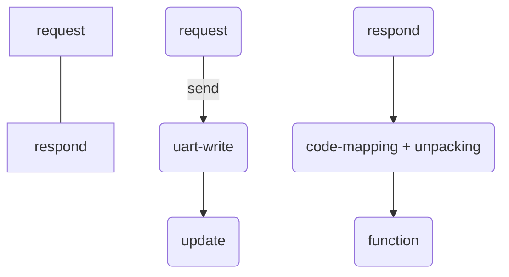

# The missions :luc_table:

## pre-tasks
jupyter-notebook, python 
[[serial-communication]]

## 1️⃣ notebooks-1 

**Library**: `lgpio`, `serial`. [[library-learning]]

**file**: `uservo.py`
`@classmethod`: add memory to the class.

**class**: `Packet+PacketBuffer`, `UartServoInfo+UartServoManager`
> Packet: Header + Code + Size + Data .
> UART: universal asynchronous receiver-transmitter

![[packet.png]]

==overall process in motherboard and servo==



> all function is a request --> `send_request(self, code, param_bytes)`.

**functions**: `ping respond_ping`, `read/write_data`, `update`

## 2️⃣ notebooks-2 
- [ ] calibration problem `01.ipynb`, `06.ipynb`.
- [ ] `joint` or `servo` angle. joint angle --> servo angle

`all routine`: 
**02.ipynb**: `set_joint_angle_list` and `set_joint_angle_list_soft` --> overall trajectory planning. `set_tool_pose`, `gripper_open`, `gripper_close` --> end control(position, pitch, roll)

`all API`:
**annotation_img9points.py**: get the 9 points picture use camera and put some annotation.
**arm_application.py**: tf transform, arm --> workspace.
**arm5dof_kinematic.py**: forward and inverse kinematics. 
**set_arm_pose_by_name.py**: the main function, imitate it!

**Key Knowledge**: quaternion and trajectory planning, Space Coordinate Transformation.

**file**:`arm5dof_uservo.py`

---
`example code:`

```python
class Test:
	def __init(self):
		pass
	# ...

# get the exmaple data, the unit is mm and degree.

# for test1
test = Test(is_debug=True)
with open('./test1.txt') as f:
    for line in f:
        wx, wy, wz = map(float, line.strip().split())

# for test2
test = Test(is_debug=False)
with open('./test2.txt') as f:
    for line in f:
        joint_angle = map(float, line.strip().split())

# for test3
test = Test(is_debug=False)
with open('./test3.txt') as f:
    for line in f:
		# pitch, roll need to convert to radians
        x6, y6, z6, pitch, roll = map(float, line.strip().split())
```

## 3️⃣ config
1. coordinate system define.
2. camera.
